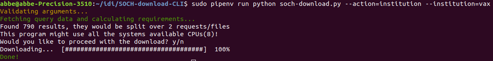

# SOCH Download CLI



SOCH Download CLI lets you do **multithreaded** batch downloads of Swedish Open Cultural Heritage(K-Samsök) records for offline processing and analytics.

## Prerequirements

 - GIT
 - Python >=3.4
 - [pipenv](https://docs.pipenv.org/)
 - An API key (get one by sending a email to ksamsok@raa.se)

## Installing

```bash
git clone https://github.com/riksantikvarieambetet/SOCH-download-CLI.git
cd SOCH-download-CLI
pipenv install
```

## Usage Examples

**Heads up: This program might use all the systems available CPUs.**

Download records based on a SOCH search query(Text, CQL, indexes, etc):

```bash
pipenv run python soch-download.py --key={API-KEY} --action=query --query=thumbnailExists=j
```

Download records from an specific institution(using the institution abbreviation):

```bash
pipenv run python soch-download.py --action=institution --institution=raa --key={API-KEY}
```

Download records using a predefined action/query:

```bash
pipenv run python soch-download.py --action=all --key={API-KEY}
pipenv run python soch-download.py --action=geodata-exists --key={API-KEY}
```

**Unpacking**

The download actions by default downloads large XML files containing up to 500 RDFs each, after such a download you can use the `unpack` argument to convert all those files into individual RDF files:

```bash
pipenv run python soch-download.py --unpack
```

**Cleaning**

You can delete all the files in both data directories with the `clean` argument.

```bash
pipenv run python soch-download.py --clean
```

**Backup**

The `backup` argument will create a zip file out of the raw data.

```bash
pipenv run python soch-download.py --backup
```

**Misc**

List all available parameters and actions:

```bash
pipenv run python soch-download.py --help
```
