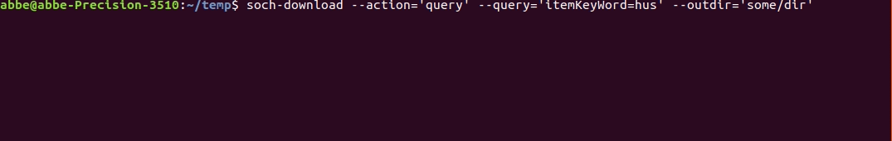

# SOCH Download CLI



SOCH Download CLI lets you do **multithreaded** batch downloads of Swedish Open Cultural Heritage (K-Samsök) records for offline processing and analytics.

## Prerequirements

 - Python >=3.4 and PIP

## Installing

```bash
pip install soch-download
```

## Usage Examples

**Heads up: This program might use all the systems available CPUs.**

Download records based on a SOCH search query (Text, CQL, indexes, etc):

```bash
soch-download --action=query --query=thumbnailExists=j --outdir=path/to/target/directory
```

Download records from an specific institution:

```bash
soch-download --action=institution --institution=raa --outdir=path/to/target/directory
```

Download records using a predefined action/query:

```bash
soch-download --action=all --outdir=path/to/target/directory
soch-download --action=geodata-exists --outdir=path/to/target/directory
```

**Unpacking**

The download actions by default downloads large XML files containing up to 500 RDFs each, after such a download you can use the `unpack` argument to convert all those files into individual RDF files:

```bash
soch-download --unpack=path/to/xml/files --outdir=path/to/target/directory
```

**Misc**

List all available parameters and actions:

```bash
soch-download --help
```

Use your own SOCH API key:

```bash
soch-download --action=query --query=itemKeyWord=hus --outdir=path/to/target/directory --key=your-api-key
```
